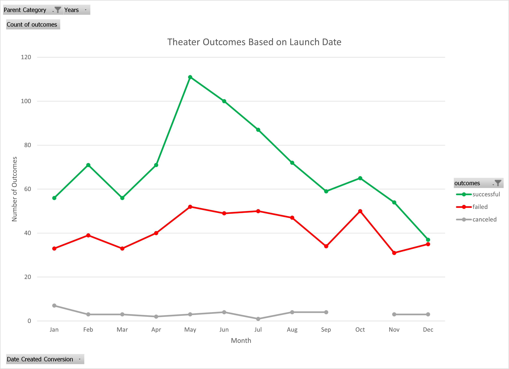
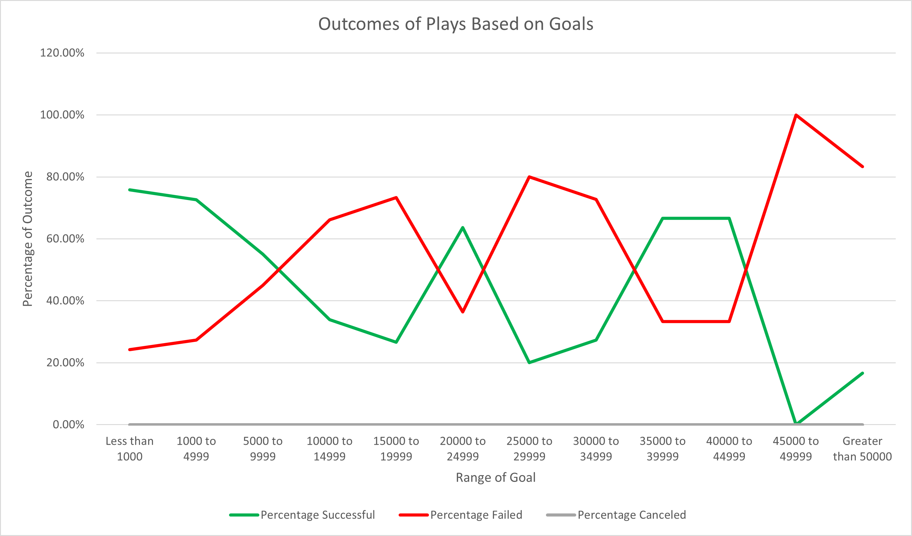

# An Analysis of Kickstarter Campaigns.

# Kickstarting with Excel

## Overview of Project

Louise recently started fundraising for a play "Fever" which ended up missing the goal by a little. She wanted to know how her fundraiser compared to others based on the launch date and their goals. We ended up performing analysis on the Kickstarter Data of Plays in the US to help Louise determine if and when to launch a crowdfunding campaign for her newest play.

## Analysis and Challenges

### Analysis of Outcomes Based on Launch Date

We performed this analysis by creating a pivot table to measure the outcomes based on the date launched. We put the outcomes in the column and the date launched in the rows section. Whats the 

### Analysis of Outcomes Based on Goals

### Challenges and Difficulties Encountered

## Results

- What are two conclusions you can draw about the Outcomes based on Launch Date?

- What can you conclude about the Outcomes based on Goals?

- What are some limitations of this dataset?

- What are some other possible tables and/or graphs that we could create?

